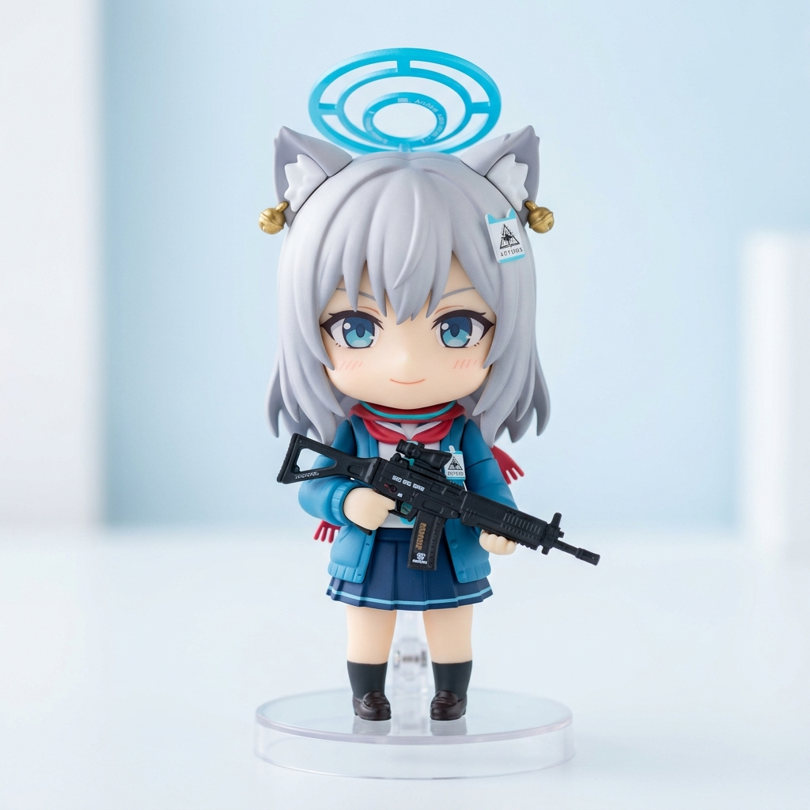
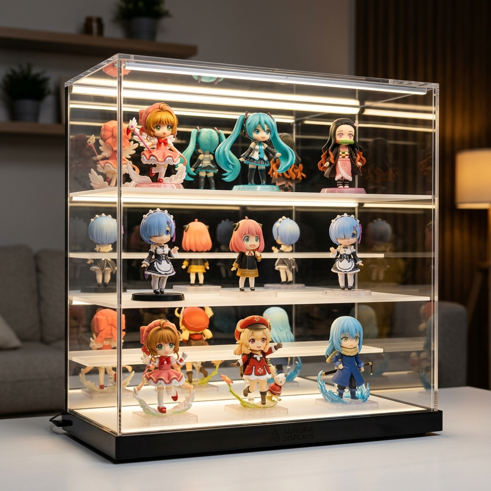
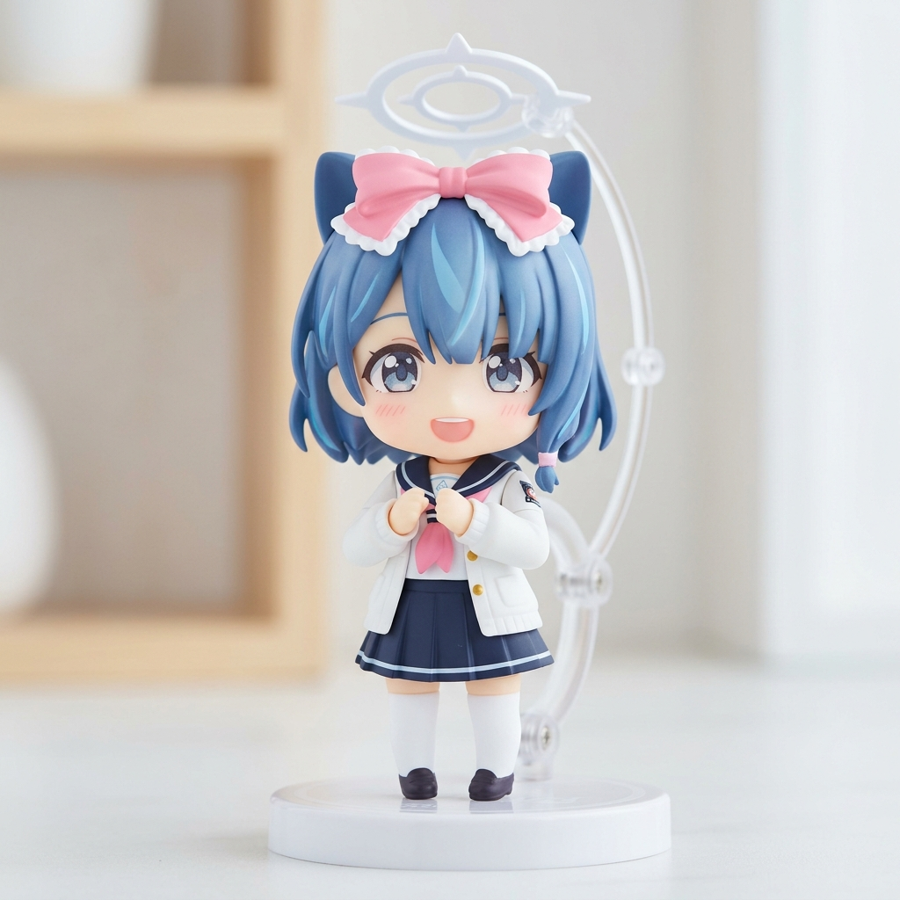

# 🇯🇵 일본 피규어 및 수집 도구 소싱 리포트 (Sourced Items Report)

본 문서는 일본 프라마켓(메르카리) 등에서 수집한 인기 소싱 상품 10선의 상세 정보와 최종 예상 한화 가격 및 실물 참고 이미지를 정리한 리포트입니다.

---

## 1. 실물 및 예시 이미지 (Top 3 Items)

소싱 상품 중 가장 선호도가 높은 상위 3가지 아이템의 참고용 생성 이미지입니다.

### 📷 [1] 시로코 넨도로이드 (砂狼シロコ ねんどろいど)

### 📷 [2] J-STAGE LED 아크릴 컬렉션 케이스

### 📷 [3] 아로나 넨도로이드 (アロナ ねんどろいど)

---

## 2. 전체 소싱 상품 10선 리스트

| ID | 번역된 한국어 상품명 | 일본 현지가 | 최종 한화 예상 견적 | 특징 |
| :--- | :--- | :--- | :--- | :--- |
| **1** | [미개봉/미품] 블루 아카이브 시로코 넨도로이드 | 6,800엔 | **70,380원** | 박스 상태 좋음, 암소 보관품 |
| **2** | [중고 미품] 피규어 케이스 J-STAGE (LED & 거울) | 11,500엔 | **113,150원** | LED 작동 확인, 전원선 포함 |
| **3** | [개봉품/부품완비] 블루 아카이브 아로나 넨도로이드 | 5,400엔 | **57,640원** | 분실 부품 없음, 끈적임 없음 |
| **4** | [미개봉/미품] 블루 아카이브 미카모 네루 넨도로이드 | 6,200엔 | **64,920원** | 정품 에어캡 2중 밀봉 보관 |
| **5** | [미개봉/특전포함] 블루 아카이브 미소노 미카 넨도로이드 | 7,200엔 | **74,020원** | 굿스마일 특전 배경지 동봉 |
| **6** | [중고 최고급] 메탈빌드 프리덤 건담 CONCEPT 2 | 28,000엔 | **309,164원** | **관부가세(18%) 가산됨** / 관절 짱짱함 |
| **7** | [미개봉 신품] 제일복권 원피스 A상 루피 피규어 | 4,500엔 | **52,180원** | **대행수수료 300엔 포함** |
| **8** | [미술관용] 피규어 전도 방지 뮤지엄 겔 100g | 2,100엔 | **30,340원** | **대행수수료 300엔 포함** |
| **9** | [먼지 제거] 타미야 정전기 방지 브러시 (새제품) | 1,800엔 | **27,610원** | **대행수수료 300엔 포함** |
| **10** | [미개봉/미품] 블루 아카이브 하야세 유우카 넨도로이드 | 6,500엔 | **67,650원** | 박스 눌림 없음, 완벽 상태 |

* 모든 계산은 100엔당 910원 환율 및 무게 0.5kg 기본 선적(8,500원)을 가정하여 진행되었습니다.
